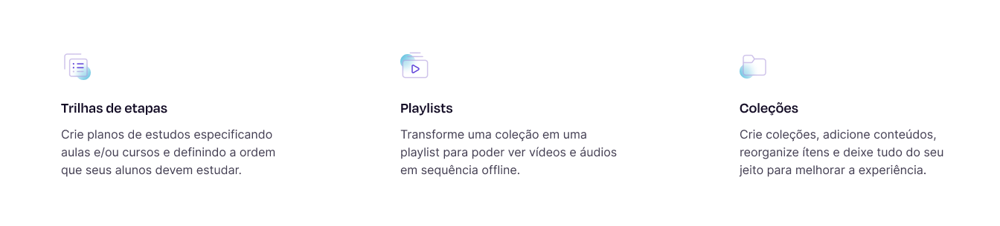

## :rocket: Teste técnico assíncrono para Analistas de Qualidade de Software (QA)

Oi! Obrigado pelo interesse em trabalhar com a gente 🙂. O objetivo desse teste é avaliar o seu nível de atenção a detalhes, noções de UI/UX, seu conhecimento em qualidade de software e sua comunicação escrita. Serão observados aspectos relacionados aos conhecimentos em boas práticas de desenvolvimento, testes exploratórios, documentação, proficiência nas tecnologias HTML, CSS e JavaScript, e no ecossistema que as cerca.

Esperamos que você resolva os problemas do enunciado de forma elegante, e demonstre seu raciocínio lógico, atenção a detalhes, capacidade de aprender e agregar valor.

## :eyes: A interface

Pixels importam pra gente. :blush:

- https://www.figma.com/file/M0jy5rqNumytQKuKZYhgPS/Ensinio-Frontend-Challenge

## :bulb: A proposta

Um dev front-end junior foi encarregado de dar os primeiros passos em uma aplicação que tende a escalar, sendo responsável por desenvolver a "seção hero" de uma tela institucional (interface demonstrada acima), utilizando HTML, CSS, TypeScript e Next.js.

Entre os requisitos que ele recebeu, estavam:

- Para a seção abaixo (vide imagem), os títulos e descrições dos itens devem ser requisitados de uma API. É esperado que a API retorne os dados contidos no arquivo "db.json", presente neste repositório.

- A interface deve ser 100% responsiva;
- A aplicação deve possuir acessibilidade;
- A interface deve ser fiel ao protótipo no figma;
- A aplicação deve estar em conformidade com as recomendações da Web Vitals;
- As requisições da aplicação devem carregar em até 600ms para usuários com conexão 3g;
- A usabilidade deve ser impecável (botões devem ter cursor do tipo pointer, devem haver feedbacks visuais de hover, etc);
- Deve ser implementada a funcionalidade de internacionalização (todos os textos da aplicação devem possuir variações para os idiomas português, inglês e espanhol; a seleção do idioma, por parte do usuário, deve ser persistida).

O dev então entregou a tarefa, e este foi o resultado: https://desafio-ensinio.vercel.app

Para as finalidades desse teste, o seu desafio enquanto analista de QA é identificar inconformidades entre os critérios de aceitação descritos acima e a entrega do dev, além de eventuais outras inconsistências (de layout, de performance, de ortografia, etc) que você encontrar na aplicação fictícia fornecida. É seu papel fornecer um relatório (via Google Docs) com recomendações técnicas práticas, que instrua o dev sobre as inconsistências.

## :page_facing_up: O que nós avaliaremos em você

- O seu nível de atenção a detalhes;
- A completude e corretude da sua análise de qualidade de software;
- Os instrumentos utilizados para as medições na aplicação;
- A qualidade de redação do seu relatório (ortografia, carga cognitiva necessária para a leitura, especificidade técnica, etc);
- Seu **empenho**: não tem problema se algo não sair como desejado, mas tente! :blush:

## :lock: Autoria

O relatório produzido durante o teste em questão **não será utilizado** para quaisquer outros fins além da sua avaliação. 

## :email: Sobre a entrega

Pedimos que, por gentileza, entregue o teste em até 6 dias a partir do recebimento das instruções, respondendo à **mesma conversa de email onde enviamos o link do desafio** e incluindo um link para o seu relatório em um documento publicamente acessível no Google Docs. :)
